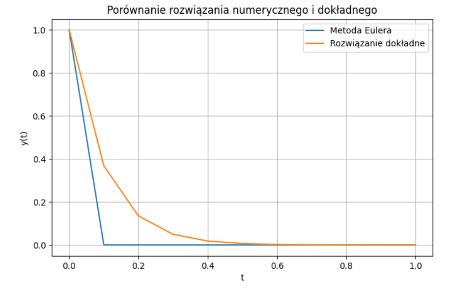
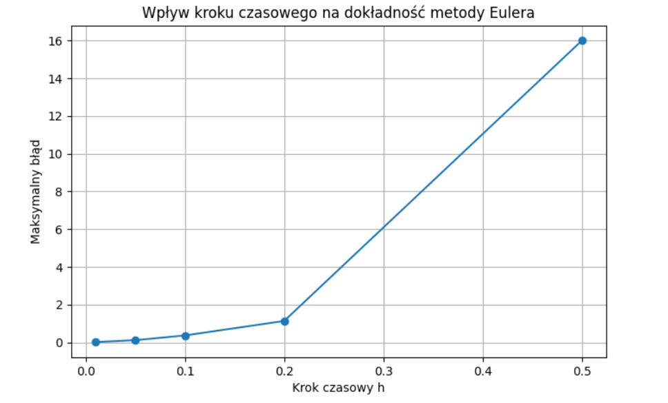
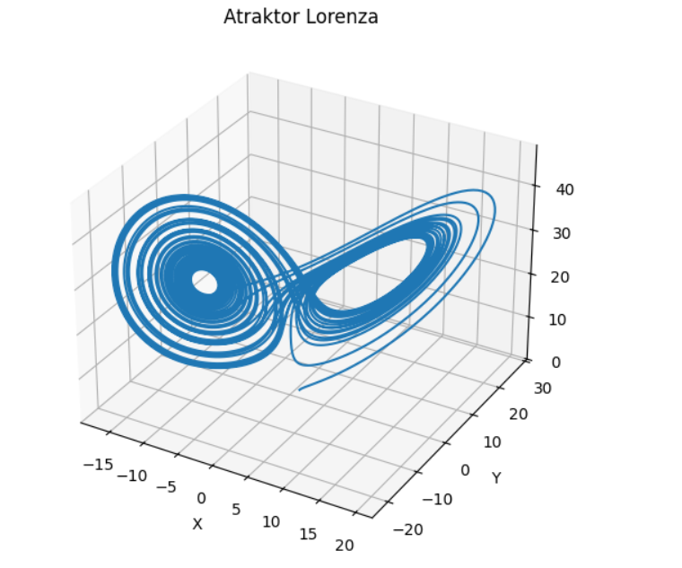

# Numeryczne rozwiązywanie równań różniczkowych zwyczajnych w Pythonie

Repozytorium przedstawia numeryczne rozwiązywanie równań różniczkowych zwyczajnych (ODE) z wykorzystaniem języka Python oraz bibliotek naukowych.

W projekcie zaimplementowano metodę Eulera i porównano rozwiązania numeryczne z rozwiązaniem symbolicznym wyznaczonym przy użyciu biblioteki SymPy. Przeprowadzono również analizę wpływu kroku czasowego na dokładność rozwiązania.

Dodatkowo przeanalizowano wybrane układy dynamiczne, takie jak model Lotki–Volterry opisujący zależność pomiędzy populacją drapieżników i ofiar oraz układ Lorenza ilustrujący zjawiska chaotyczne.

## Cel projektu

Celem projektu było zastosowanie metod numerycznych do rozwiązywania równań różniczkowych zwyczajnych oraz analiza zachowania wybranych modeli matematycznych.

## Zakres analizy

Projekt obejmuje:

- implementację metody Eulera,
- porównanie rozwiązania numerycznego i symbolicznego,
- analizę dokładności metody dla różnych kroków czasowych,
- model Lotki–Volterry,
- układ Lorenza,
- wizualizację wyników w środowisku Jupyter Notebook.

## Wykorzystane technologie

- Python
- NumPy
- SciPy
- SymPy
- Matplotlib
- Jupyter Notebook

## Czego nauczyłam się podczas projektu

Podczas realizacji projektu nauczyłam się:

- implementacji metod numerycznych do rozwiązywania równań różniczkowych,
- porównywania rozwiązań numerycznych i symbolicznych,
- analizy wpływu kroku czasowego na dokładność rozwiązania,
- modelowania wybranych układów dynamicznych,
- wizualizacji wyników obliczeń z wykorzystaniem biblioteki Matplotlib,
- wykorzystania bibliotek naukowych do analizy numerycznej w Pythonie.

## Wizualizacje wyników

### Porównanie rozwiązania numerycznego i dokładnego

Porównanie rozwiązania uzyskanego metodą Eulera z rozwiązaniem dokładnym równania różniczkowego.

### Analiza dokładności metody Eulera

Wpływ kroku czasowego na maksymalny błąd rozwiązania numerycznego.

### Układ Lorenza

Wizualizacja atraktora Lorenza przedstawiającego zachowanie układu chaotycznego.

## Wnioski

Przeprowadzona analiza pokazuje, że metody numeryczne umożliwiają skuteczne przybliżanie rozwiązań równań różniczkowych zwyczajnych. Dokładność rozwiązania zależy od wielkości kroku czasowego — jego zmniejszenie prowadzi do ograniczenia błędu numerycznego.

Analiza modeli Lotki–Volterry i Lorenza pozwoliła zaobserwować zachowanie wybranych układów dynamicznych oraz zilustrować ich zmienność w czasie za pomocą wizualizacji.

